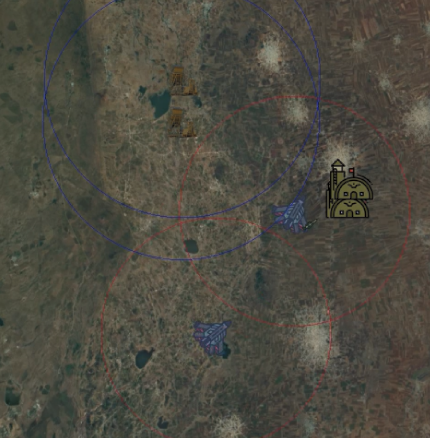

# Missile-Command

The objective of this project is to evaluate Reinforcement Learning (RL) algorithms within the context of a multi-agent competitive scenario. Our scenarios are implemented in a mini real-time strategy (RTS) game, crafted specifically as a testbed for multi-agent RL. This setup provides a backdrop for assessing the efficacy, adaptability, and strategic depth of various RL algorithms in decision making, cooperation, and competition in a simulated setting.

## How to Run

This guide will walk you through setting up and running the project. Follow these steps to get started:

### 1. Start a New Python Project with a Virtual Environment

Create a new Python project and set up a virtual environment. This ensures that your project's dependencies do not conflict with those of other Python projects on your machine.

### 2. Install Dependencies

Use `pip` to install the necessary packages:

- **PyTorch**: Install a version that is compatible with your machine. It's recommended to follow the installation instructions on the [official PyTorch website](https://pytorch.org/).
- **RLlib**: Installation instructions can be found on the [official RLlib website](https://docs.ray.io/en/latest/rllib.html).
- **Other Requirements**: Most other dependencies are included in the above installations, but if additional packages are required, they can be downloaded via `pip` as needed.

### 3. Running the Code

To verify that everything is working or to begin training, use the following scripts:

- **`random_agent`**: Run this to test if everything is set up correctly.
- **`rllib_agent`**: Use this script to start training.
- **`rllib_agent_record`**: To test a checkpoint and save the video, use this script.

## Project Structure

- **`gym_missile_command` folder**: Contains environment files. `missile_command_env` is the main environment we used, with other variants still being WIP (Work In Progress).

- **`sprites` folder**: Graphics for the environment. Feel free to change the files to suit your preferences.

- **`agents` folder**: Scripts for running algorithms.
  - `random_agent`: A random agent to test the environment.
  - `DQN_agent`: A basic script implementing DQN for testing.
  - `rllib_agent`: Use this to train RLlib algorithms on the environment. We currently support PPO & IMPALA.

